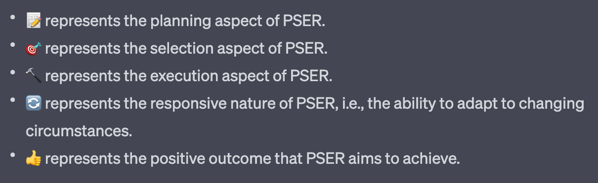

# 📝🎯🔨🔄👍 PSER: Plan, Select, Execute, Respond

An implementation of the HuggingGPT system ("HuggingGPT: Solving AI Tasks with ChatGPT and its Friends in HuggingFace": https://arxiv.org/pdf/2303.17580.pdf), except more general and extensible.

## Setup:

0. Sign up / get your OpenAI API key: https://platform.openai.com/signup

0. Create the env file: `cp .env.example .env`, put your API key where specified

0. Install deps: `pip3 install -r requirements.txt`

0. Run: `python3 src/main.py`

## Credits:

Prompts and ideas were heavily taken from these projects:

* JARVIS (https://github.com/microsoft/JARVIS)

* Langchain (https://github.com/hwchase17/langchain)